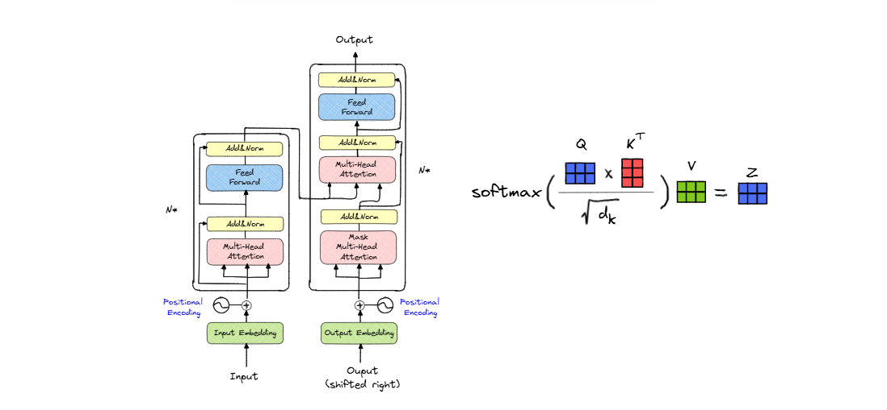

# Transformer Model

This repository contains a PyTorch implementation of the Transformer architecture described in the original paper (Attention is all you Need).

## Overview

The model includes:
- Input embeddings
- Positional encoding
- Multi-head attention
- Residual connections
- Layer normalization
- Feed-forward blocks
- Encoder and decoder stacks
- Output projection layer

## Main File

- `model.py` contains the full model implementation and the `build_transformer(...)` constructor.

## Usage

Create a transformer model with:
    from model import build_transformer

    model = build_transformer(
        src_vocab_size=10000,
        tgt_vocab_size=10000,
        src_seq_len=128,
        tgt_seq_len=128,
        d_model=512,
        N=6,
        h=8,
        dropout=0.1,
        d_ff=2048
    )